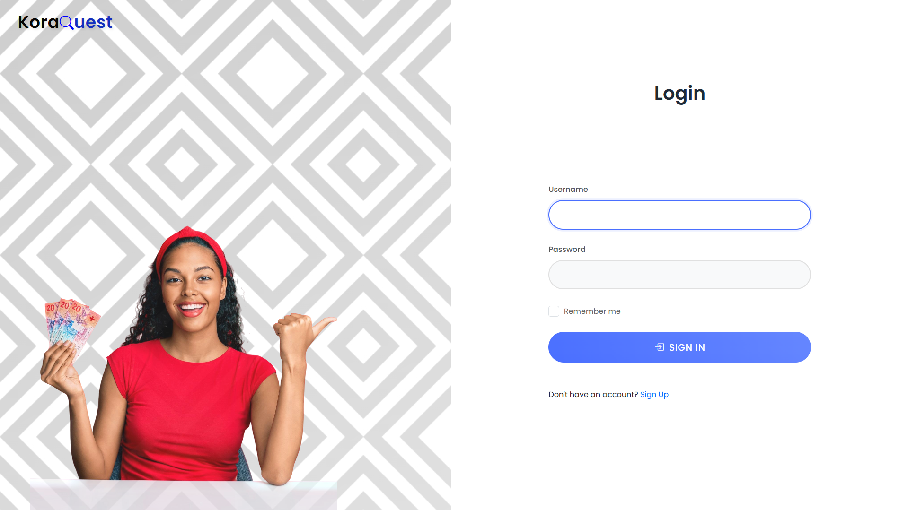

# KoraQuest

KoraQuest is a Django-based web application that has the purpose of helping people to buy and sell products amongst each other.



## 🌐 Demo UI

- **Live Website**: [KoraQuest Marketplace](https://koraquest.bonasolutions.tech)
- **Demo Video**: [Watch Demo](https://youtube.com/watch?v=your-demo-video-id](https://youtu.be/x3JjtgzZsGA?si=6HRMwlj9GTLLGAjL)

## 🚀 Features

- User Authentication System
- QR Code Generation and Processing
- Account Upgrading (From Buyer to Vendor)
- Media File Management
- Static File Handling
- Email Integration (with OTP support)

## 📋 Prerequisites

Before you begin, ensure you have the following installed:
- Python 3.x
- pip (Python package manager)
- Git

## 🛠️ Installation

1. Clone the repository
```bash
git clone https://github.com/Bonaparte003/KoraQuest.git
cd KoraQuest
```

2. Create a virtual environment
```bash
python -m venv venv

# On Windows
venv\Scripts\activate

# On macOS/Linux
source venv/bin/activate
```

3. Install dependencies
```bash
pip install -r requirements.txt
```

4. Set up the database
```bash
python manage.py migrate
```

5. Create a superuser (admin)
```bash
python manage.py createsuperuser
```

6. Collect static files
```bash
python manage.py collectstatic
```

## ⚙️ Configuration


1. Update email settings in `KoraQuest/settings.py` if needed:
```python
EMAIL_BACKEND = 'django.core.mail.backends.smtp.EmailBackend'
EMAIL_HOST = 'smtp.gmail.com'
EMAIL_PORT = 587
EMAIL_USE_TLS = True
```

or 

Reconfigure settings to send actual emails check
- [Django Email Documentation](https://docs.djangoproject.com/en/5.2/topics/email)


## 🚀 Running the Application

1. Start the development server
```bash
python manage.py runserver
```

2. Access the application:
- Main site: http://127.0.0.1:8000
- Admin interface: http://127.0.0.1:8000/admin

## 📁 Project Structure

```
KoraQuest/
├── authentication/       # Authentication app
├── KoraQuest/          # Main project directory
├── static/             # Static files
├── media/              # User uploaded files
├── templates/          # HTML templates
└── manage.py          # Django management script
```

## 🔒 Security Notes

1. In production:
- Set `DEBUG = False`
- Use a strong `SECRET_KEY`
- Configure proper `ALLOWED_HOSTS`
- Use secure email settings
- Enable HTTPS

2. For local development:
- The default SQLite database is sufficient
- Debug mode is enabled by default
- Email backend is set to console for development

## 📝 Additional Notes

- QR codes are configured to update every 10 minutes
- Static files are served from the 'staticfiles' directory
- Media files are stored in the 'media' directory
- The project uses Django's built-in authentication system with custom user model

## 🤝 Contributing

1. Fork the repository
2. Create your feature branch (`git checkout -b feature/AmazingFeature`)
3. Commit your changes (`git commit -m 'Add some AmazingFeature'`)
4. Push to the branch (`git push origin feature/AmazingFeature`)
5. Open a Pull Request

## 📄 License

This project is licensed under the MIT License - see the LICENSE file for details.

## 👥 Authors

- UTERAMAHORO Avellin Bonaparte - Initial work

## 🙏 Acknowledgments

- Django Framework
- Python Community
- All contributors
